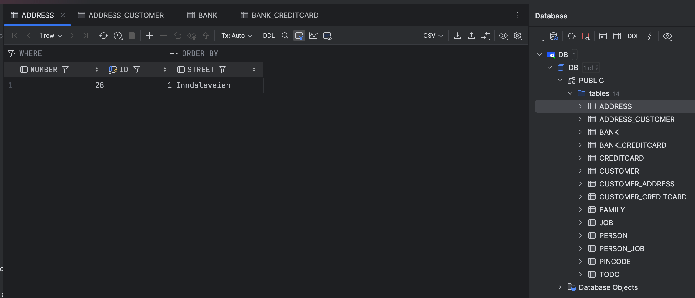

## Expass 4
Link to my repository for this assignment: https://github.com/kajaws/expass4

### Technical problems that encountered during installation and how they were resolved
I did not experience any particular technical issues during the installation process.

### Questions:
The database used in this project is an H2 database, which is a lightweight embedded database. It starts automatically when the application runs and stops when the application shuts down.
Tables are created automatically based on the JPA annotations in the codebase.

The SQL used to create the table Customer is as follows:
```sql
CREATE TABLE Customer (
    id BIGINT PRIMARY KEY AUTO_INCREMENT,
    name VARCHAR(255)
);
```

### Inspecting the database tables
I inspected the database tables by using IntelliJ's built-in database tool. I added a new database connection, selected H2 as the database type since the project contains an H2 database file, and set the file path to the DB.mv.db file from the project directory.
As you can see on the screenshot below, I got an overview of the tables created in the database. The tables correspond to the entities in the project.


