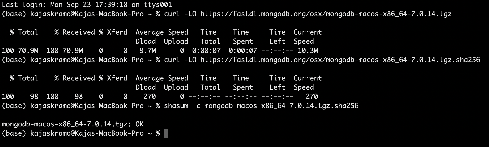
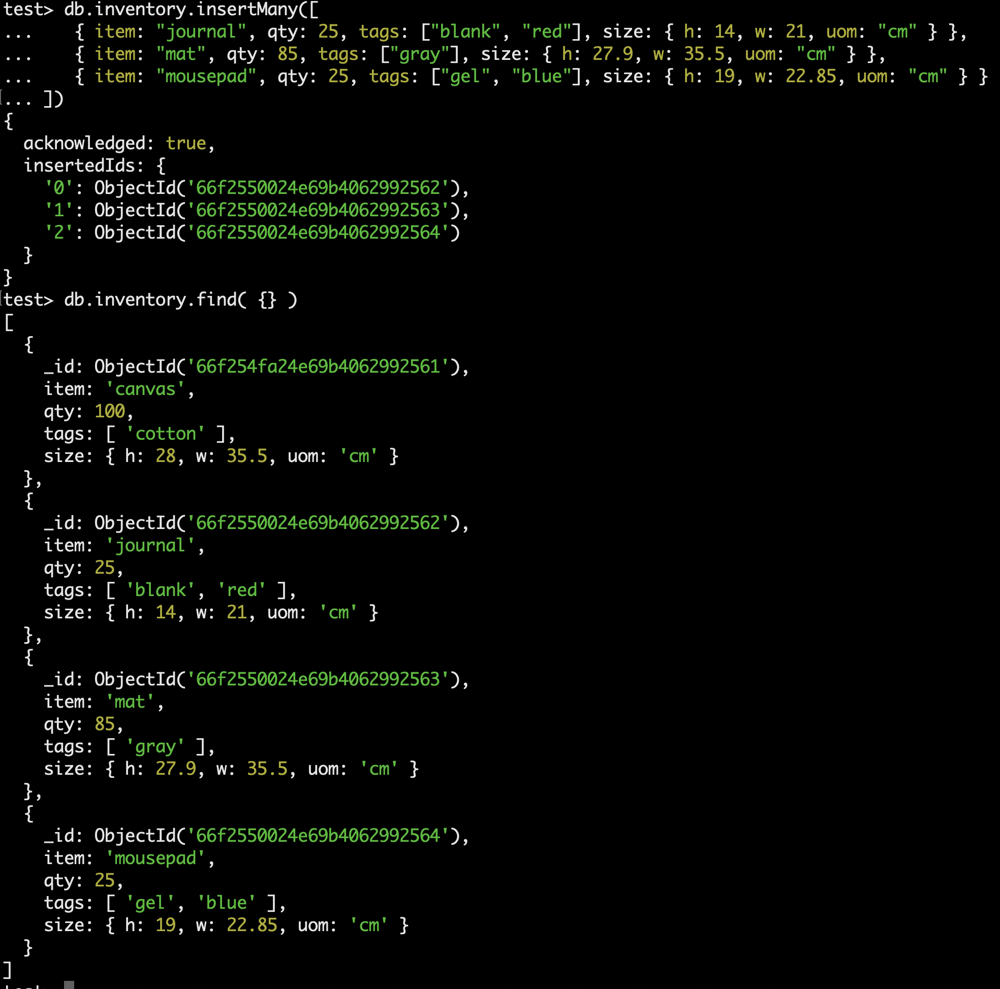
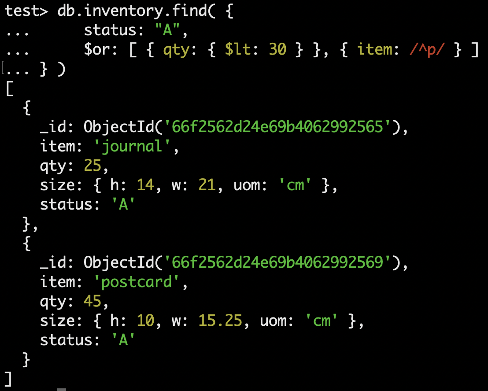
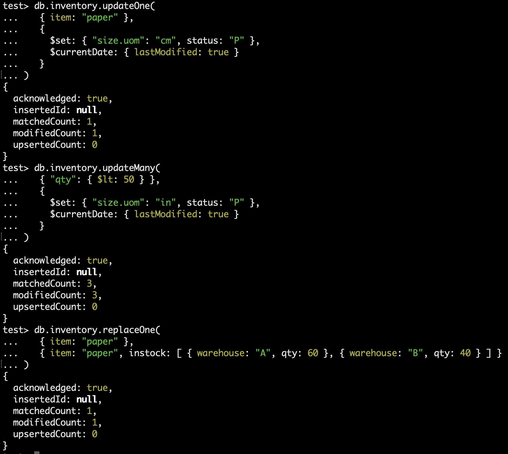
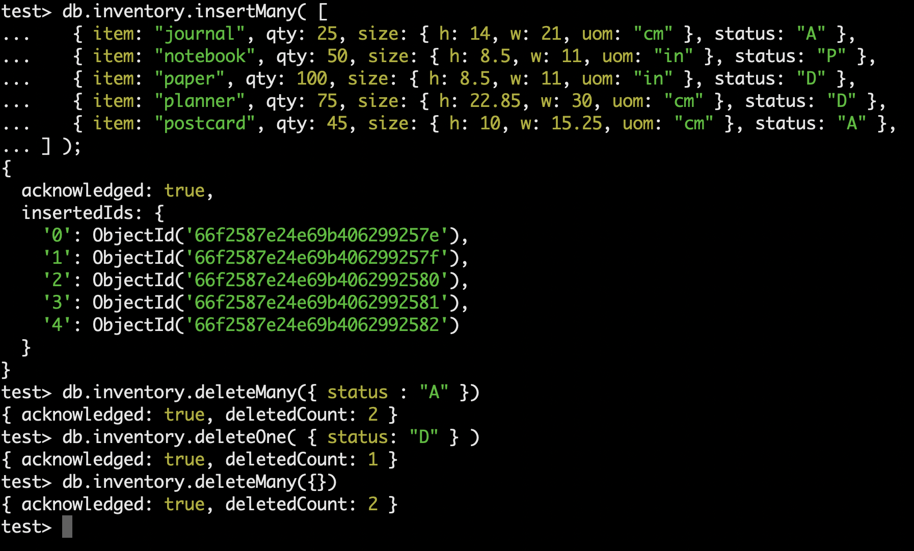
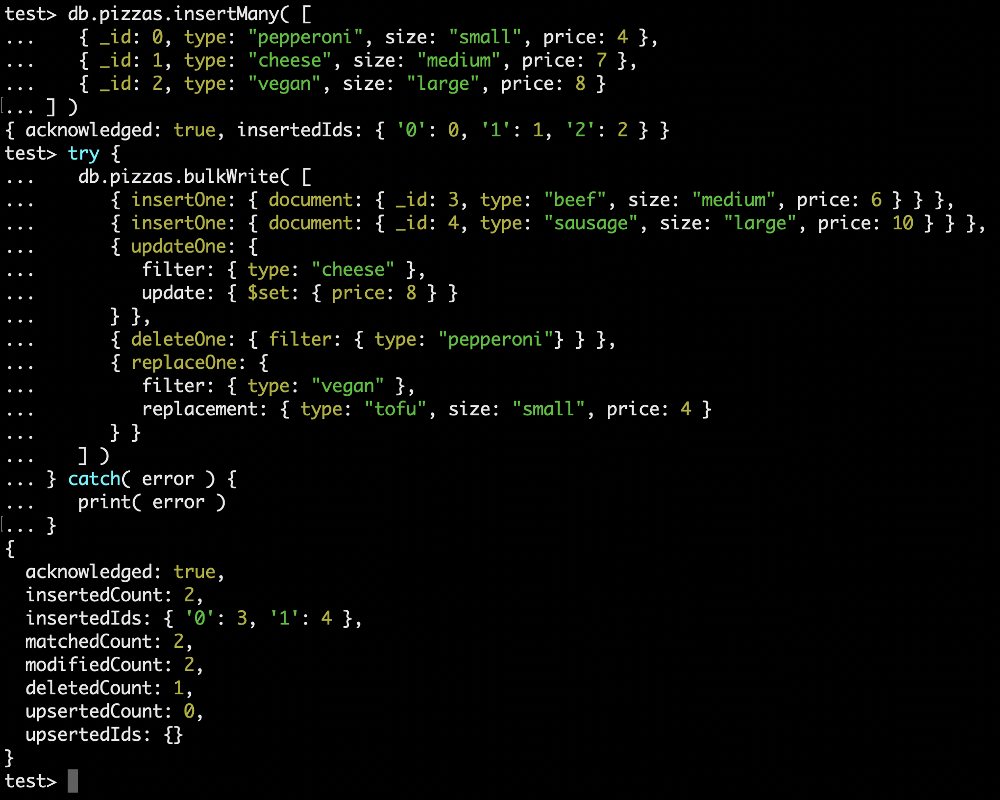
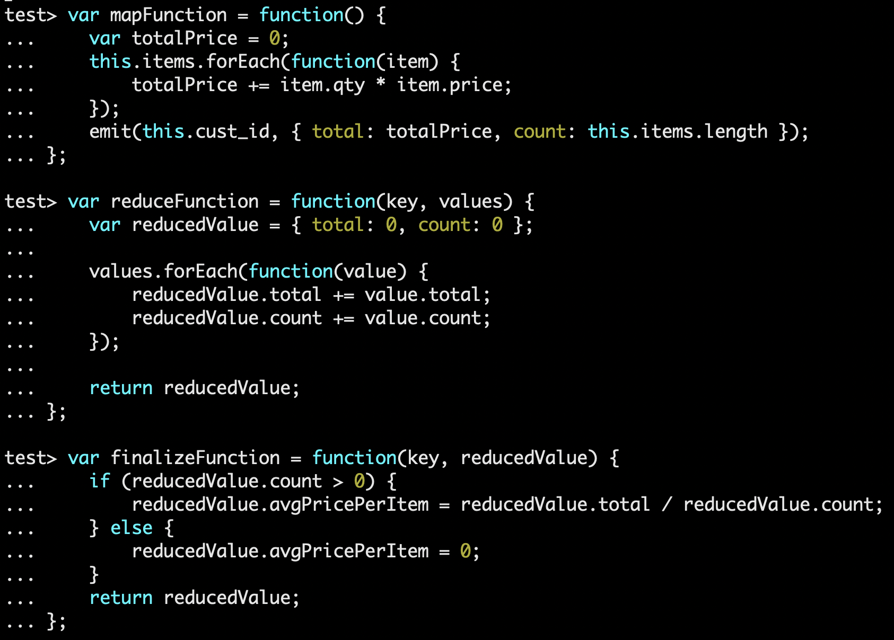
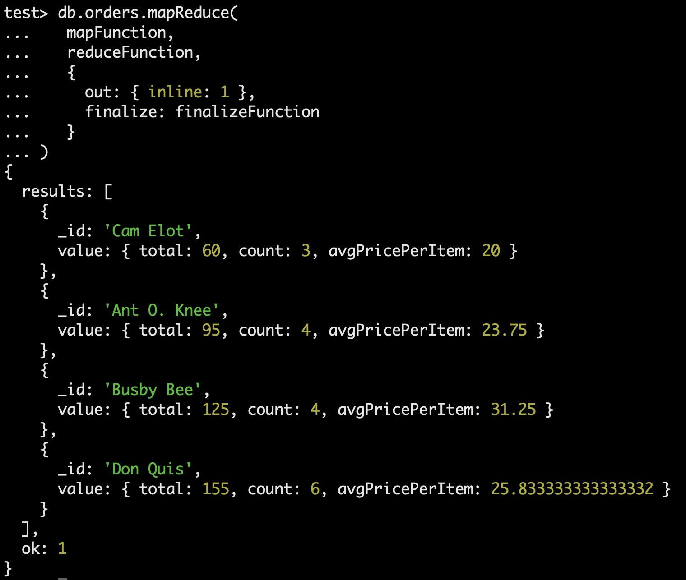

# Expass 5

## Technical problems that encountered during installation and how they were resolved
I did not experience any particular technical issues during the installation process.

## Installation package

## Experiment 1
### Insert-documents

### Query-documents

### Update-documents

### Remove-documents

### Bulk-write-operations

## Experiment 2
### My Map-Reduce function
My map-reduce function calculates the average price of goods per customer based on their orders. I have used the following map and reduce functions:

### Map-Reduce result

### Reason about why the implemented Map-reduce operation is useful and interpret the collection obtained.
This map-reduce operation is useful because it provides the company with insight into how much customers pay on average per item in their orders. 
This way, the company can understand customer purchasing patterns, such as who prefers the more expensive items, and adjust prices accordingly.

So, based on the results I got, it is Busby Bee who, on average, pays the most per item, while Cam Elot pays the least per item.