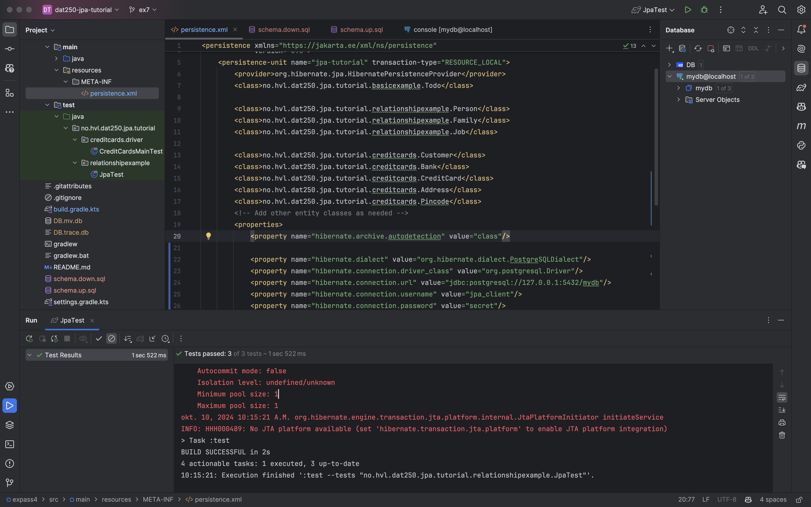
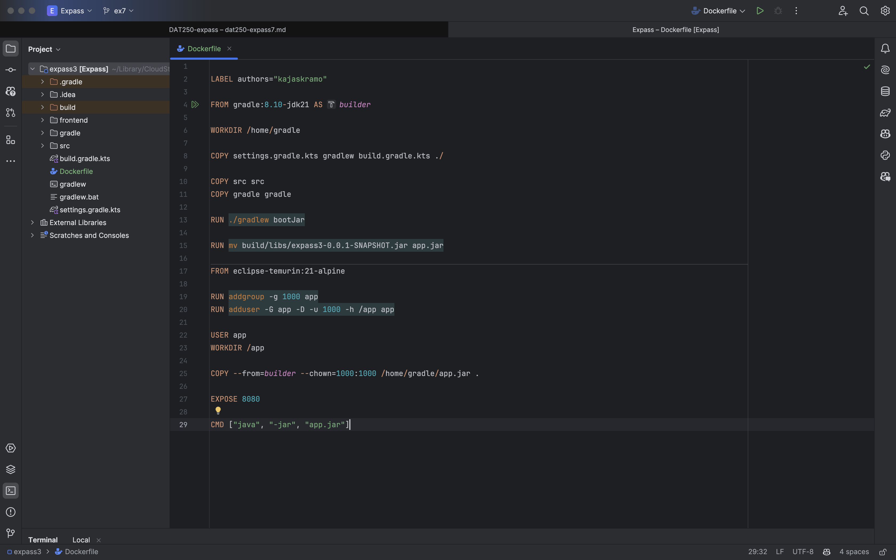

## Expass 7

### Using a Dockerized application: PostgreSQL
Now my tests can run with a PostgreSQL database instead of an H2 database. 

### Building you own dockerized application
The dockerfile used to build the container:

The docker container is built with the following command:
- `docker build -t image`

The container is then run with the following command:
- `docker run -d -p 8080:8080 --name myapp-container image`